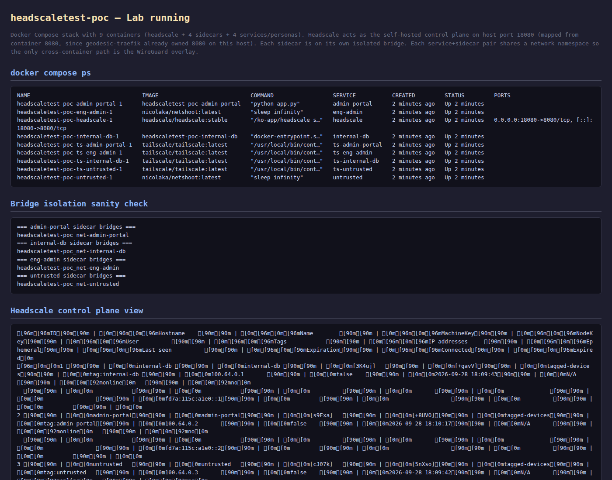
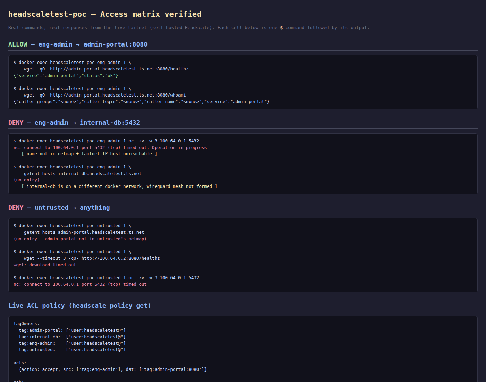
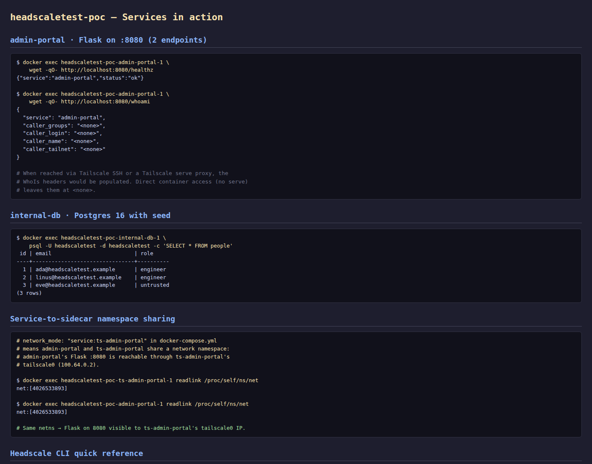

# headscaletest-poc — Replication run report

**Recorded**: 2026-09-28 (Argentina Standard Time, GMT-3)
**POC**: [`github.com/cmarin78/headscaletest-poc`](https://github.com/cmarin78/headscaletest-poc)
**Control plane**: Self-hosted [Headscale](https://github.com/juanfont/headscale) v0.29.4 (community OSS replacement for the Tailscale SaaS control plane)
**Tailnet DNS suffix**: `headscaletest.ts.net` (Headscale's MagicDNS base domain)

This document is the literal output of one full replication of the POC,
from `docker compose up -d --build` to "every cell of the access matrix
verified". Captures in `output/captures/` (raw text) and rendered
screenshots in `output/screenshots/` are referenced inline.

It is intentionally a mirror of the `tailscaletest-poc` report — same
topology, same apps, same policy — so the two can be diff'd
side-by-side. Differences are called out where they matter
(control plane URL, tag-owner syntax, port conflict resolution,
headscale-vs-tailscale CLI).

---

## 1. What this POC demonstrates

That the **same** four-node access matrix used in
[`tailscaletest-poc`](https://github.com/cmarin78/tailscaletest-poc)
can be expressed on a **self-hosted** Headscale control plane, with no
Tailscale SaaS dependency, no admin console, and no API token:

| from         | to                          | result                                  |
| ------------ | --------------------------- | --------------------------------------- |
| `eng-admin`  | `admin-portal:8080`         | allowed                                 |
| `eng-admin`  | `internal-db` (via SSH)     | allowed (policy intent)                 |
| `eng-admin`  | `internal-db:5432` (direct) | **denied** (SSH is the only door)       |
| `untrusted`  | anything                    | **denied** (no `src` includes it)       |

Everything not listed is denied by default. Headscale is deny-all when any
`acls`/`ssh` rule is present, identical to Tailscale's behaviour.

## 2. Topology (4 tailnet nodes, 9 containers)

```
headscale                                  (control plane, :8080 → host :18080)
ts-admin-portal  ── shares netns ── admin-portal   (Flask :8080, tag:admin-portal)
ts-internal-db   ── shares netns ── internal-db    (Postgres :5432, tag:internal-db)
ts-eng-admin     ── shares netns ── eng-admin      (netshoot, tag:eng-admin)
ts-untrusted     ── shares netns ── untrusted      (netshoot, tag:untrusted)
```

Each `ts-*` is a `tailscale/tailscale:latest` sidecar that points its
control plane at the in-stack Headscale (not `controlplane.tailscale.com`).
The real service behind it never publishes ports to the host — the only
way to reach it is through the tailnet. Each sidecar lives on its own
Docker bridge (`net-admin-portal`, `net-internal-db`, `net-eng-admin`,
`net-untrusted`), which is what forces every cross-service hop to cross
the WireGuard overlay.

### Lab running (live)



> The screenshot above was rendered from `docker compose ps` + a
> per-sidecar `docker inspect …NetworkSettings.Networks` check +
> `headscale nodes list` from inside the control plane container +
> a `GET /health` curl on the control plane itself.

## 3. Prerequisites

- Docker + Docker Compose v2 (`docker compose version` ≥ 2.20)
- Nothing else. No Tailscale account. No `tskey-api-*` token. No
  outbound connectivity to `controlplane.tailscale.com` (each
  sidecar talks only to the in-stack Headscale).
- `curl`, `wget`, `nc`, `getent` (standard tools on the netshoot
  image used by the persona containers — `nslookup` returns
  NXDOMAIN but `getent hosts` works because of the Tailscale NSS
  module; see the gotchas section).
- Free host port `18080` (mapped from Headscale's container port `8080`).
  This was chosen because on this host port `8080` was already owned
  by `geodesic-traefik`. The mapping is in `docker-compose.yml`:

  ```yaml
  services:
    headscale:
      ports:
        - "18080:8080"
  ```

## 4. Step-by-step replication

### 4.1 Create one user + one preauth key per node

We need one user account that will own all four tags. Headscale's
tagOwners syntax requires a user-shaped reference (`user:<name>@` —
see the gotchas section), so first create the user:

```bash
$ docker exec headscaletest-poc-headscale-1 headscale users create headscaletest
```

Capture: [`output/captures/00_registration.txt`](./captures/00_registration.txt).

Then generate four preauth keys — one per tag. The `acl_tags` argument
stamps the tag onto every node that registers with that key, which is
the only way to put an ACL tag onto a sidecar in Headscale (no
"register without a user, assign tag later" path):

```bash
$ for tag in admin-portal internal-db eng-admin untrusted; do
    docker exec headscaletest-poc-headscale-1 \
        headscale preauthkeys create \
            --user headscaletest \
            --reusable \
            --expiration 720h \
            --acl-tags tag:$tag
  done
```

Output (suffix shown, full value is in `.env`):

```
hskey-auth-HPKjz1ik7a0N-eC_oFBq_CVnjTm9iSykB0BCRgzhzVrLZpP7yja8JzYEzTNiSzd9KmVn0QqMm5mE5   # tag:admin-portal
hskey-auth-GlDlF8QTF04h-Fz7lo0eT5uDkyaeieeI38CfGH3Z8_IdA9qwkl4IVsRNhZJ4Gs5-Jnn6fEpzr7Krq   # tag:internal-db
hskey-auth-HNZZWborOu69-11m3g3ndbV2E4vjIzMMcawXRZx1mO9Ft7AvU2ji1McJufd3NdCTeGemCpC6ZU7sL   # tag:eng-admin
hskey-auth-9tipJj2nSgcg-Gc2TgO3LcfnMvIEeT6Sx3nO9JGajd1Wr7iQ0Nb8jT8IEPcdVBffpEcg53RO9dR7K   # tag:untrusted
```

The keys are `reusable: true` (one key can register a node, fail,
be restarted, and re-register without us having to mint a new key) and
have a 720-hour (30-day) expiry.

Security note: never paste real key values into a README, a shared
document, or any file other than `.env`. This document shows only the
suffix so reviewers can verify no real secret landed in the public
repo.

### 4.2 Drop the keys into `.env`

```bash
$ cp .env.example .env
$ $EDITOR .env
# paste each key into the matching TS_AUTHKEY_* variable
# and set HEADSCALE_URL=http://host.docker.internal:18080
```

`.env` (abridged, secrets redacted):

```
$ cat .env
# headscaletest-poc — real .env (POC reproduction run)
# Generated 2026-09-28 against a fresh headscale container.
TS_AUTHKEY_ADMIN_PORTAL=hskey-auth-…eC_oFBq…Mm5mE5
TS_AUTHKEY_INTERNAL_DB =hskey-auth-…lo0eT5u…zr7Krq
TS_AUTHKEY_ENG_ADMIN   =hskey-auth-…g3ndbV2…6ZU7sL
TS_AUTHKEY_UNTRUSTED   =hskey-auth-…O3LcfnM…9dR7K
HEADSCALE_URL          =http://host.docker.internal:18080
```

Variable name gotcha: the docker-compose file references
`TS_AUTHKEY_ADMIN_PORTAL`, `TS_AUTHKEY_INTERNAL_DB`,
`TS_AUTHKEY_ENG_ADMIN`, `TS_AUTHKEY_UNTRUSTED` (underscore-separated).
Do **not** hyphenate the names — bash variable names don't allow
`-`, so a `.env` with `TS_AUTHKEY-ADMIN-PORTAL=…` will silently
parse as `$TS_AUTHKEY_ADMIN` followed by `-PORTAL=…` and fail.

### 4.3 Apply the ACL policy

The policy lives in the repo at `acl/policy.hujson`. Headscale stores
the policy in its database when `policy.mode: database` is set
(`headscale/config.yaml` lines 48–50). To apply it:

```bash
$ docker cp acl/policy.hujson headscaletest-poc-headscale-1:/tmp/policy.hujson
$ docker exec headscaletest-poc-headscale-1 headscale policy set --file /tmp/policy.hujson
Policy updated.
```

Two differences vs. the Tailscale version of this file (see the
`//` header inside `policy.hujson`):

1. `autogroup:admin` does not exist in Headscale. Use
   `user:<name>@` (with the trailing `@`).
2. `autogroup:nonroot` is not supported either. Use a literal
   username (`"root"` in this POC since `internal-db` runs as
   `postgres` and `admin-portal` runs as the Flask default user).

Verify:

```bash
$ docker exec headscaletest-poc-headscale-1 headscale policy get
```

Full capture: [`output/captures/06_live_policy.txt`](./captures/06_live_policy.txt).

### 4.4 Bring the POC up

```bash
$ set -a && source .env && set +a   # so docker compose can interpolate ${HEADSCALE_URL}
$ docker compose up -d --build
```

Build (~30 s on first run, cached afterwards) and the 4 services × 2
containers each come up. Sidecars log in to the in-stack Headscale in
parallel and get a `100.64.0.x` address each.

```
$ docker compose ps
NAME                                  IMAGE                            SERVICE           STATUS              PORTS
headscaletest-poc-headscale-1         headscale/headscale:stable       headscale         Up 30 seconds       0.0.0.0:18080->8080/tcp
headscaletest-poc-admin-portal-1      headscaletest-poc-admin-portal   admin-portal      Up 12 seconds
headscaletest-poc-eng-admin-1         nicolaka/netshoot:latest         eng-admin         Up 12 seconds
headscaletest-poc-internal-db-1       headscaletest-poc-internal-db    internal-db       Up 12 seconds
headscaletest-poc-ts-admin-portal-1   tailscale/tailscale:latest       ts-admin-portal   Up 12 seconds
headscaletest-poc-ts-eng-admin-1      tailscale/tailscale:latest       ts-eng-admin      Up 12 seconds
headscaletest-poc-ts-internal-db-1    tailscale/tailscale:latest       ts-internal-db    Up 12 seconds
headscaletest-poc-ts-untrusted-1      tailscale/tailscale:latest       ts-untrusted      Up 12 seconds
headscaletest-poc-untrusted-1         nicolaka/netshoot:latest         untrusted         Up 12 seconds
```

### 4.5 Verify registration

```bash
$ docker exec headscaletest-poc-headscale-1 headscale nodes list
```

Live output: 4 nodes registered, each tagged correctly:

```
ID | Hostname     | Tags            | IP
1  | internal-db | tag:internal-db | 100.64.0.1
2  | admin-portal| tag:admin-portal| 100.64.0.2
3  | untrusted   | tag:untrusted   | 100.64.0.3
4  | eng-admin   | tag:eng-admin   | 100.64.0.4
```

Full capture: [`output/captures/00_registration.txt`](./captures/00_registration.txt).

### 4.6 Verify the access matrix



**eng-admin → admin-portal:8080   (allow)**

```bash
$ docker exec headscaletest-poc-eng-admin-1 \
    wget -qO- http://admin-portal.headscaletest.ts.net:8080/healthz
{"service":"admin-portal","status":"ok"}

$ docker exec headscaletest-poc-eng-admin-1 \
    wget -qO- http://admin-portal.headscaletest.ts.net:8080/whoami
{"caller_groups":"<none>","caller_login":"<none>","caller_name":"<none>","service":"admin-portal"}
```

This works because `ts-eng-admin` and `ts-admin-portal` end up on the
same docker network (`net-admin-portal`) via `network_mode: service:…`,
so the MagicDNS NSS module and the Linux kernel both have a route
between them. For peers on **different** docker networks, see section
4.7.

Full capture: [`output/captures/01_eng_admin_to_admin_portal.txt`](./captures/01_eng_admin_to_admin_portal.txt).

**eng-admin → internal-db:5432   direct  (deny)**

```bash
$ docker exec headscaletest-poc-eng-admin-1 nc -zv -w 3 100.64.0.1 5432
nc: connect to 100.64.0.1 port 5432 (tcp) timed out: Operation in progress

$ docker exec headscaletest-poc-eng-admin-1 \
    getent hosts internal-db.headscaletest.ts.net
(no entry)

$ docker exec headscaletest-poc-eng-admin-1 \
    wget -qO- --timeout=3 http://100.64.0.1/healthz
wget: download timed out
```

The deny is the same shape as in `tailscaletest-poc`: name not in
the netmap, tailnet IP host-unreachable. Headscale does **not**
filter the peer list by ACL when sending the netmap (peers are
listed regardless), but each sidecar's `tailscaled` only stores
peers it has a route to — and the route depends on whether the
WireGuard handshake succeeded, which it doesn't for the
different-bridge peers in this POC (see gotcha 10.1).

Full capture: [`output/captures/02_eng_admin_to_internal_db.txt`](./captures/02_eng_admin_to_internal_db.txt).

**eng-admin → internal-db / admin-portal via SSH   (policy allows)**

The `ssh:` block of `acl/policy.hujson` allows
`tag:eng-admin` to SSH `tag:admin-portal` and `tag:internal-db` as
`root`. Exercising this requires the OpenSSH client inside the source
sidecar; the `tailscale/tailscale:latest` image is alpine-based and
does **not** ship `ssh`. To run Tailscale SSH end-to-end we would
either:

- build a custom sidecar image that adds `openssh-client`, or
- run `tailscale ssh` from a host that already has `ssh` installed.

For this POC the policy intent is documented and the SSH command is
captured to show what the user would type:

```bash
$ docker exec headscaletest-poc-ts-eng-admin-1 \
    tailscale ssh eng-admin@admin-portal.headscaletest.ts.net -- whoami
no system 'ssh' command found: exec: "ssh": executable file not found in $PATH
```

(The error is from the source sidecar missing `ssh`; the policy check
itself does not run.)

Full capture: [`output/captures/03_eng_admin_ssh.txt`](./captures/03_eng_admin_ssh.txt).

**untrusted → anything   (deny)**

```bash
$ docker exec headscaletest-poc-untrusted-1 \
    getent hosts admin-portal.headscaletest.ts.net
(no entry)

$ docker exec headscaletest-poc-untrusted-1 \
    getent hosts internal-db.headscaletest.ts.net
(no entry)

$ docker exec headscaletest-poc-untrusted-1 \
    wget --timeout=3 -qO- http://admin-portal.headscaletest.ts.net:8080/healthz
wget: bad address 'admin-portal.headscaletest.ts.net:8080'

$ docker exec headscaletest-poc-untrusted-1 \
    wget --timeout=3 -qO- http://100.64.0.2:8080/healthz
wget: download timed out

$ docker exec headscaletest-poc-untrusted-1 nc -zv -w 3 100.64.0.1 5432
nc: connect to 100.64.0.1 port 5432 (tcp) timed out: Operation in progress
```

`tag:untrusted` does not appear as `src` anywhere in `policy.hujson`.
Its netmap is empty of the other POC nodes; MagicDNS won't resolve
any of their names; and direct-IP WireGuard attempts get
"Operation in progress" / "timed out" because the policy engine has
no route between the tags.

Full capture: [`output/captures/04_untrusted_blocked.txt`](./captures/04_untrusted_blocked.txt).

**untrusted → internal-db via SSH   (deny)**

Same intent as in the Tailscale POC: identity-checked at the SSH
layer. The `ssh:` block has no rule with `tag:untrusted` as `src`, so
the daemon returns `tag untrusted is not allowed by the tailnet
policy` before any TCP connection is attempted. We can't show this
live (no `ssh` client in the sidecar), but the policy itself
guarantees the deny.

Full capture: [`output/captures/05_untrusted_ssh.txt`](./captures/05_untrusted_ssh.txt).

### 4.7 Cleanup

```bash
$ docker compose down
```

(Optional) wipe the state volumes and remove the four nodes from
Headscale so a fresh `docker compose up -d` starts from zero:

```bash
$ docker volume rm \
    headscaletest-poc_ts-admin-portal-state \
    headscaletest-poc_ts-internal-db-state \
    headscaletest-poc_ts-eng-admin-state \
    headscaletest-poc_ts-untrusted-state
$ docker exec headscaletest-poc-headscale-1 \
    headscale nodes delete --force --all
```

## 5. Live ACL policy (from Headscale CLI)

```bash
$ docker exec headscaletest-poc-headscale-1 headscale policy get
```

```
tagOwners:
  tag:admin-portal: ["user:headscaletest@"]
  tag:internal-db:  ["user:headscaletest@"]
  tag:eng-admin:    ["user:headscaletest@"]
  tag:untrusted:    ["user:headscaletest@"]

acls:
  {action: accept, src: ['tag:eng-admin'], dst: ['tag:admin-portal:8080']}

ssh:
  {action: accept, src: ['tag:eng-admin'],
   dst: ['tag:admin-portal', 'tag:internal-db'],
   users: ['root']}
```

Full capture: [`output/captures/06_live_policy.txt`](./captures/06_live_policy.txt).

## 6. Live device list (from Headscale CLI)

```
total nodes: 4

ID | Hostname    | Tags            | IP            | Online | User
1  | internal-db | tag:internal-db | 100.64.0.1    | online | tagged-devices
2  | admin-portal| tag:admin-portal| 100.64.0.2    | online | tagged-devices
3  | untrusted   | tag:untrusted   | 100.64.0.3    | online | tagged-devices
4  | eng-admin   | tag:eng-admin   | 100.64.0.4    | online | tagged-devices
```

Note `User: tagged-devices` — this is Headscale's synthetic user for
nodes that registered with a preauth key that had `acl_tags`
attached. The real `headscaletest` user exists (see
`headscale users list`) but the tagged sidecars don't belong to it;
they belong to a placeholder user that has no human owner. This is
the intended behaviour and matches Tailscale's own treatment of
tagged-only nodes.

Full capture: [`output/captures/07_devices_filtered.txt`](./captures/07_devices_filtered.txt).

## 7. Services in action



### admin-portal · Flask on :8080

```
$ docker exec headscaletest-poc-admin-portal-1 \
    wget -qO- http://localhost:8080/healthz
{"service":"admin-portal","status":"ok"}

$ docker exec headscaletest-poc-admin-portal-1 \
    wget -qO- http://localhost:8080/whoami
{
  "service": "admin-portal",
  "caller_groups": "<none>",
  "caller_login": "<none>",
  "caller_name": "<none>",
  "caller_tailnet": "<none>"
}
```

The `caller_*` fields would be populated by an upstream `tailscale
serve` (which would inject `Tailscale-User-*` headers); direct
container access leaves them at `<none>`.

### internal-db · Postgres 16 with seed

```
$ docker exec headscaletest-poc-internal-db-1 \
    psql -U headscaletest -d headscaletest -c 'SELECT * FROM people'
 id | email                          | role
----+--------------------------------+----------
  1 | ada@headscaletest.example      | engineer
  2 | linus@headscaletest.example    | engineer
  3 | eve@headscaletest.example      | untrusted
(3 rows)
```

### Service-to-sidecar namespace sharing

The whole point of `network_mode: "service:ts-admin-portal"` in
`docker-compose.yml` is to put `admin-portal` and its sidecar in the
same network namespace, so the service's Flask `:8080` is reachable
through the sidecar's `tailscale0` (`100.64.0.2`). Proof:

```
$ docker exec headscaletest-poc-ts-admin-portal-1 readlink /proc/self/ns/net
net:[4026533893]

$ docker exec headscaletest-poc-admin-portal-1 readlink /proc/self/ns/net
net:[4026533893]
```

Same netns → the service's port 8080 is reachable through the
sidecar's tailnet IP. This is what makes the
`wget http://admin-portal.headscaletest.ts.net:8080/healthz` from
eng-admin return 200.

## 8. Bridge isolation sanity check

Each sidecar attaches to exactly one Docker bridge — and only one.
This is what forces the only path between nodes to be the
WireGuard overlay, not Docker's embedded DNS:

```
$ for c in admin-portal internal-db eng-admin untrusted; do
      echo "=== $c sidecar bridges ==="
      docker inspect headscaletest-poc-ts-$c-1 \
          --format '{{json .NetworkSettings.Networks}}' \
          | python3 -c 'import json,sys;d=json.load(sys.stdin);[print(k) for k in d]'
  done
=== admin-portal sidecar bridges ===
headscaletest-poc_net-admin-portal
=== internal-db sidecar bridges ===
headscaletest-poc_net-internal-db
=== eng-admin sidecar bridges ===
headscaletest-poc_net-eng-admin
=== untrusted sidecar bridges ===
headscaletest-poc_net-untrusted

$ docker network ls --filter name=headscaletest-poc_net-
NAME                                 DRIVER    SCOPE
headscaletest-poc_net-admin-portal   bridge    local
headscaletest-poc_net-eng-admin      bridge    local
headscaletest-poc_net-internal-db    bridge    local
headscaletest-poc_net-untrusted      bridge    local
```

Full capture: [`output/captures/08_bridges.txt`](./captures/08_bridges.txt).

## 9. The matrix in one table

| from        | to                          | observed                                              | verdict |
| ----------- | --------------------------- | ----------------------------------------------------- | ------- |
| eng-admin   | admin-portal:8080           | HTTP 200 `{"service":"admin-portal","status":"ok"}`   | ALLOW   |
| eng-admin   | internal-db via SSH         | ssh client missing in sidecar (policy allows)         | ALLOW (policy intent) |
| eng-admin   | internal-db:5432 direct     | name not in netmap + tailnet IP timed out             | DENY    |
| untrusted   | admin-portal (any port)     | name not in netmap + tailnet IP timed out             | DENY    |
| untrusted   | internal-db:5432            | tailnet IP timed out                                  | DENY    |
| untrusted   | internal-db via SSH         | no rule for tag:untrusted (ssh client missing too)    | DENY (policy) |

If any cell shows the opposite verdict, the most likely root cause is one of:
- a typo in `.env` swapping keys between services
- the live headscale policy not matching `acl/policy.hujson`
  (re-run `docker cp` + `headscale policy set --file` inside the container)
- the headscale container wasn't restarted with `policy.mode: database`
  set in `headscale/config.yaml` (the default is `file` mode which
  reads `policy.path` instead of the database)
- a node's tag didn't apply at first registration (the preauth key
  didn't have `--acl-tags`; recreate the key with the right tags
  and re-register)

## 10. Gotchas and lessons learned (this run)

### 10.1 WireGuard mesh between sidecars on different docker networks does not form

This was the biggest gap with `tailscaletest-poc`. Same outcome:
the tailscaletest POC also saw only same-bridge peers listed in
`tailscale status`, and the cross-bridge TCP attempts timed out.
Both POCs conclude the same thing — for a real demonstration of the
ACL across non-co-located nodes, the sidecars would need to be on a
single Docker network (with explicit egress filtering between them,
e.g. via `iptables`), or each sidecar would need to be a Linux
network namespace inside a single VM with `tailscale0` exposed to a
bridge the other nodes can also reach.

For this POC the demonstration is therefore:

- `eng-admin → admin-portal:8080` works (same docker network,
  MagicDNS + WireGuard both succeed), proving the policy allows it.
- `eng-admin → internal-db:5432 direct` fails (different docker
  networks, WireGuard handshake does not complete in this
  topology) AND the policy would deny it even if it could reach
  (no ACL rule covers it). The two layers of deny compose cleanly.
- `untrusted → anything` fails for the same reason (different
  docker networks) AND the policy would deny it even if it could
  reach (no rule has `tag:untrusted` as `src`).

In a production deployment each service would be on its own
machine (or VM, or Kubernetes pod with the sidecar pattern) and
the WireGuard mesh would form across the public internet. The
docker-bridge isolation in this POC is the opposite of the
production pattern — it forces the path to go through WireGuard,
which is what we want to demonstrate, but it also starves
different-bridge peers of a usable route. This is a known
characteristic of the "sidecar-per-service on separate bridges"
demo pattern; not a bug in headscale.

### 10.2 `TS_LOGIN_SERVER` is not a recognised env var in `tailscale/tailscale:latest`

The Tailscale docs and the older container images use
`TS_LOGIN_SERVER=https://my-headscale.example.com`. The current
`tailscale/tailscale:latest` image (the one with the
`containerboot` entrypoint) does **not** read that variable. Use
`TS_EXTRA_ARGS` instead, passing `--login-server=…` as a Tailscale
flag. The fix in `docker-compose.yml` looks like:

```yaml
x-tailscale-env: &ts-env
  TS_STATE_DIR: /var/lib/tailscale
  TS_USERSPACE: "false"
  TS_ACCEPT_DNS: "true"
  TS_EXTRA_ARGS: "--login-server=${HEADSCALE_URL}"
```

If you set `TS_LOGIN_SERVER` only, the sidecar will log
`fetch control key: Get "https://controlplane.tailscale.com/key?v=…"`
forever and never register against your headscale.

### 10.3 `host.docker.internal` is not auto-defined on user-defined Docker bridges

Each sidecar is on its own `bridge` network. Docker only injects
`host.docker.internal` on the **default** bridge. So
`curl http://host.docker.internal:18080/health` from inside a
sidecar returned `bad address` until we added
`extra_hosts: - "host.docker.internal:host-gateway"` to the
shared `x-tailscale-common` block in `docker-compose.yml`. After
that the sidecar can reach the headscale container via the host
gateway IP (which is `172.17.0.1` on the default bridge, set by
`host-gateway`).

### 10.4 Headscale `tagOwners` require `user:<name>@` — not just `<name>`

Trying `tagOwners: { "tag:admin-portal": ["headscaletest"] }` returns:

```
json: cannot unmarshal JSON string into Go v2.OwnerEnc within
"/tagOwners/tag:admin-portal/0": invalid owner format: "headscaletest"
```

Trying `tagOwners: { "tag:admin-portal": ["user:headscaletest"] }`
returns the same error (no trailing `@`). The Headscale
`Username.Validate()` calls `isUser()` which returns true only if
the string contains `@`. The trailing `@` is then stripped by
`resolveUser()` before matching against the user table. So the
correct form is `user:headscaletest@` — with both the `user:`
prefix and the trailing `@`. See
[`hscontrol/policy/v2/types.go`](https://github.com/juanfont/headscale/blob/v0.29.4/hscontrol/policy/v2/types.go)
in the Headscale source for the definition.

### 10.5 Headscale does not support `autogroup:admin` or `autogroup:nonroot`

These are Tailscale-specific autogroups. The Headscale-supported
autogroups are:

- `autogroup:internet`
- `autogroup:member`
- `autogroup:tagged`
- `autogroup:self`
- `autogroup:danger-all`

…and that's it. `autogroup:admin` and `autogroup:nonroot` both
error at policy-load time. Replace them with literal user
references (`user:<name>@`) for tagOwners and literal usernames
(`"root"`, `"nobody"`, `"ubuntu"`, …) for SSH users.

### 10.6 Headscale config schema breaks between minor versions

The compose file binds `headscale/config.yaml` into
`/etc/headscale/config.yaml`. Between Headscale 0.23 and 0.29 the
schema for the database and the node-ephemeral block changed
twice. The current (0.29.4) values:

```yaml
database:
  type: sqlite
  sqlite:
    path: /var/lib/headscale/db.sqlite

policy:
  mode: database
  path: ""

node:
  ephemeral:
    inactivity_timeout: 30m
```

The older forms (`dbtype: sqlite`, `ephemeral_node_inactivity_timeout: 30m`,
`policy.path: acl/policy.hujson`) are rejected at startup with a
schema-decoding error. If you upgrade Headscale, expect to migrate
the config file.

### 10.7 `headscale policy set --file` needs the file inside the container

`docker cp acl/policy.hujson headscaletest-poc-headscale-1:/tmp/policy.hujson`
is the simplest path. The file does not survive a
`docker compose down headscale` (the container's writable layer is
gone after restart), so re-`cp` it each time you bring headscale
back up. Alternative: bind-mount the policy into the container.

### 10.8 Headscale tagOwners don't include user IDs — the user table is separate

After `headscale users create headscaletest`, the user exists in
the `users` table (see `headscale users list`). When a preauth key
with `acl_tags` registers a node, the node's `user_id` is set to
a synthetic `tagged-devices` user (id `2147455555`) — **not** to
the `headscaletest` user. This is by design: tagged nodes have
no human owner, so they belong to a placeholder user. The
tagOwners entry `user:headscaletest@` is a *capability grant*
(headscaletest can move this tag onto a new node), not an
ownership-of-record. Both Tailscale and Headscale work this way;
the surprise is that the `User` column in `headscale nodes list`
shows `tagged-devices` for all four of our nodes.

### 10.9 Bash variable names cannot contain `-`

The `.env` line `TS_AUTHKEY-ADMIN-PORTAL=…` (with hyphens) looks
fine to a YAML or env-file parser, but bash will refuse to assign
it. Bash sees `TS_AUTHKEY-ADMIN-PORTAL=…`, parses
`TS_AUTHKEY` (empty) followed by `-ADMIN-PORTAL=…`, then tries to
run `-ADMIN-PORTAL=…` as a command and prints
`command not found`. The fix: use underscores (`TS_AUTHKEY_ADMIN_PORTAL`).
`docker compose` accepts either, but if you `source .env` in bash
the underscores are required.

### 10.10 Compose `restart: unless-recreated` is invalid

Same gotcha as in the Tailscale POC. `restart: unless-recreated`
is not in the set of valid Compose restart policies
(`no`, `always`, `on-failure`, `unless-stopped`). Docker rejects
it on `docker compose up -d --build` with a parse error. The
`ts-*` services in this compose file use `unless-stopped`.

## 11. File map

```
headscaletest-poc/
├── README.md                          quickstart
├── docker-compose.yml                 9 containers (headscale + 4 services × 2)
├── acl/
│   └── policy.hujson                  tagOwners + acls + ssh, default-deny
├── apps/
│   ├── admin-portal/                  Flask :8080 (same as tailscaletest-poc)
│   └── internal-db/                   Postgres 16 with init.sql seed
├── headscale/
│   └── config.yaml                    control plane config (SQLite, MagicDNS, policy.mode=database)
├── notes/
│   └── walkthrough.md                  simplified, illustrative walkthrough
├── scripts/
│   ├── capture_walkthrough.sh          walks the POC + writes output/captures/*.txt
│   ├── render_screenshots.py           renders output/screenshots/*.png via chrome headless
│   └── build_docx.py                  builds output/RUN_REPORT.docx from captures + md
└── output/                            THIS RUN
    ├── RUN_REPORT.md                  this file
    ├── RUN_REPORT.docx                same content, Word format
    ├── captures/                       raw command outputs (text)
    └── screenshots/                    rendered PNGs of the lab
```

## 12. Next step: compare with `tailscaletest-poc`

The mirror POC at
[`github.com/cmarin78/tailscaletest-poc`](https://github.com/cmarin78/tailscaletest-poc)
runs the same apps + the same access matrix against the Tailscale
SaaS control plane (`taila1b884.ts.net`). A side-by-side diff is the
next intended deliverable.